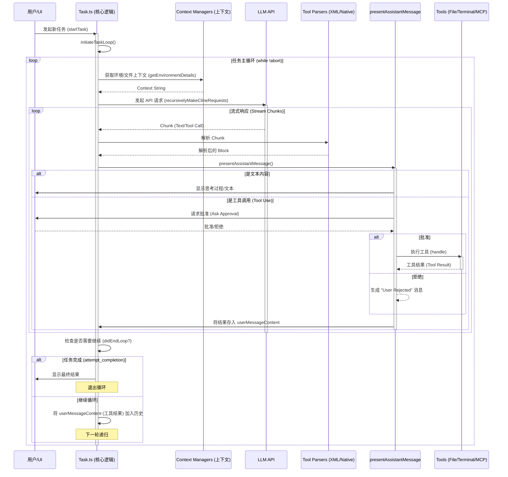

# Roo Code Agentic 模式循环流程完整分析

本文档详细分析了 Roo Code (原 Cline) 的 Agentic 模式（自主代理模式）的核心循环流程。该流程主要由 `src/core/task/Task.ts` 中的 `Task` 类编排，并通过 `presentAssistantMessage.ts` 处理与 LLM 的交互和工具调用。

## 1. 核心流程概览

Roo Code 的 Agentic 循环是一个递归的“请求-响应-执行-反馈”闭环。其核心理念是：
1.  **构建上下文**：收集环境信息、文件内容、用户输入。
2.  **发起请求**：将上下文发送给 LLM。
3.  **流式处理**：实时解析 LLM 的响应（文本或工具调用）。
4.  **执行工具**：在用户批准后执行工具（如读写文件、运行命令）。
5.  **反馈结果**：将工具执行结果作为新的“用户消息”反馈给 LLM。
6.  **递归/循环**：LLM 根据反馈决定下一步操作，直到完成任务。

## 2. 流程可视化 (Mermaid)

## 3. 详细链路分析

### 3.1 启动阶段 (Initialization)

入口点位于 `Task.ts`。

1.  **`startTask(task, images)`**:
    *   初始化 `clineMessages` 和 `apiConversationHistory`。
    *   发送初始的用户消息（包含 `<task>` 标签）。
    *   调用 `initiateTaskLoop`。

2.  **`initiateTaskLoop(userContent)`**:
    *   启动后台 Checkpoint 服务 (`getCheckpointService`)。
    *   进入 `while (!this.abort)` 主循环。
    *   调用核心递归函数 `recursivelyMakeClineRequests`。

### 3.2 递归请求循环 (The Recursive Cycle)

核心逻辑位于 `recursivelyMakeClineRequests`。这个函数并不只是发一次请求，而是一个处理“LLM 思考 -> 工具执行 -> 结果反馈”的引擎。

1.  **上下文准备**:
    *   调用 `processUserContentMentions` 处理 `@` 提及的文件。
    *   调用 `getEnvironmentDetails` 获取当前项目结构、终端状态、时间等信息。
    *   **关键点**: 环境信息被包裹在 `<environment_details>` 标签中，确保 LLM 始终了解当前状态。

2.  **API 请求 (`attemptApiRequest`)**:
    *   构建完整的 Prompt（System Prompt + History + Current Context）。
    *   使用 `this.api.createMessage` 发起流式请求。

3.  **流式解析**:
    *   监听流事件 (`text`, `usage`, `tool_call_start/delta/end`)。
    *   使用 `NativeToolCallParser` (针对 Native API) 或 `AssistantMessageParser` (针对 XML) 处理数据块。
    *   实时构建 `assistantMessageContent` 数组。
    *   **关键调用**: 每收到一个完整的 Block 或更新，立即调用 `presentAssistantMessage`。

### 3.3 响应处理与工具执行 (Response Processing)

逻辑位于 `src/core/assistant-message/presentAssistantMessage.ts`。这是连接 LLM 思维与实际操作的桥梁。

该函数是一个**锁定的异步处理器** (`presentAssistantMessageLocked`)，防止并发更新导致的状态错乱。

1.  **分发处理**:
    *   根据 `block.type` (`text`, `tool_use`, `mcp_tool_use`) 进行分发。

2.  **文本处理**:
    *   即时更新 UI 上的流式文本输出。
    *   处理 `<thinking>` 标签的显示与隐藏。

3.  **工具调用处理**:
    *   **验证**: 检查工具是否在当前模式允许的范围内 (`validateToolUse`)。
    *   **查重**: `ToolRepetitionDetector` 防止 LLM 陷入死循环重复调用同一工具。
    *   **批准**: 通过 `askApproval` 弹窗或自动批准逻辑，请求用户确认。
    *   **执行**: 调用对应的 Tool Handler (例如 `writeToFileTool`, `executeCommandTool`)。
    *   **结果回填**:
        *   工具执行的结果（Stdout, File Content, Error）被封装为 `tool_result`。
        *   结果被推送到 `cline.userMessageContent` 数组中。

### 3.4 反馈循环 (The Feedback Loop)

一旦 `recursivelyMakeClineRequests` 中的流结束：

1.  **检查 `userMessageContent`**:
    *   如果在流式传输过程中执行了工具，`userMessageContent` 此时包含了工具的执行结果。
2.  **更新历史**:
    *   将 LLM 的响应 (`assistant` role) 加入 `apiConversationHistory`。
    *   将工具的结果 (`user` role) 加入 `apiConversationHistory`。
3.  **递归判定**:
    *   如果 `userMessageContent` 不为空（意味着有工具被执行并产生了结果），`recursivelyMakeClineRequests` 会利用 `stack` 机制或循环，使用**新的历史记录**再次发起 API 请求。
    *   LLM 看到工具的结果后，会进行下一步思考。

### 3.5 任务完成 (Completion)

当 LLM 决定任务已完成时：

1.  LLM 调用 `attempt_completion` 工具。
2.  `presentAssistantMessage` 识别到此工具。
3.  显示最终结果给用户。
4.  `recursivelyMakeClineRequests` 返回 `didEndLoop = true`。
5.  `initiateTaskLoop` 中的主循环检测到 `didEndLoop`，跳出循环，任务结束。

## 4. 关键机制总结

*   **Context-Awareness (上下文感知)**: 每次请求前都会重新抓取环境详情和文件结构，确保 LLM 拥有最新的“视野”。
*   **Human-in-the-loop (人在环路)**: 所有关键操作（特别是写文件和运行命令）默认需要用户批准，这是安全性的核心。
*   **Protocol Agnostic (协议无关)**: 系统通过 Parser 层抹平了不同 LLM 提供商（Native Tool Calling vs XML Parsing）的差异，上层逻辑统一处理 `ToolUse` 对象。
*   **State Persistence (状态持久化)**: `Task.ts` 维护了完整的会话历史，支持将任务保存到磁盘 (`task-persistence`) 并在之后恢复。
