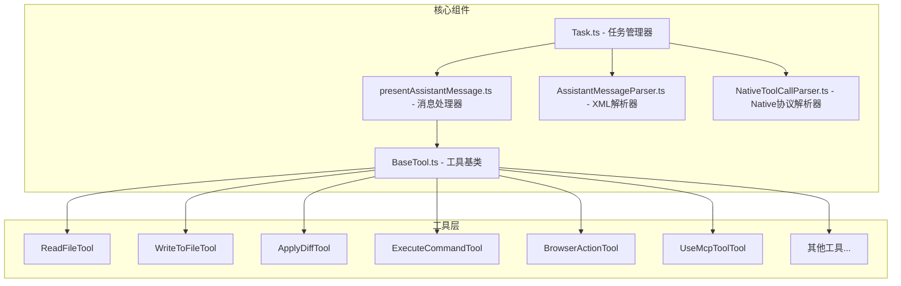
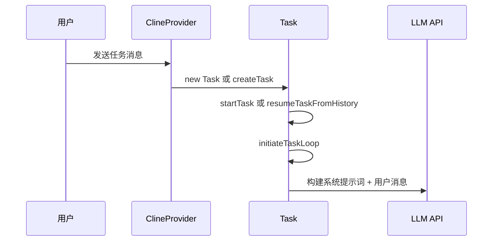
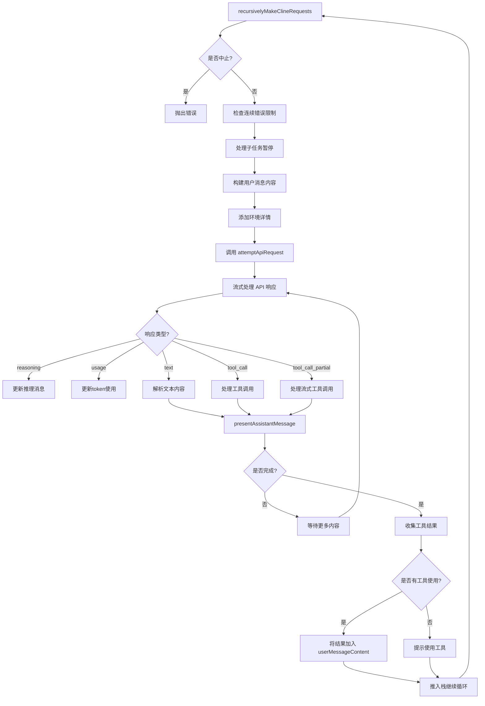
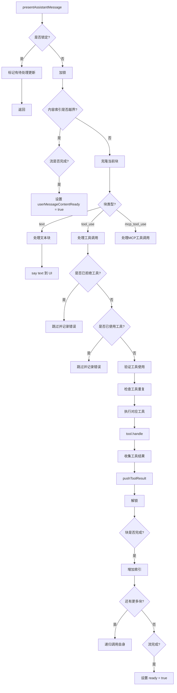
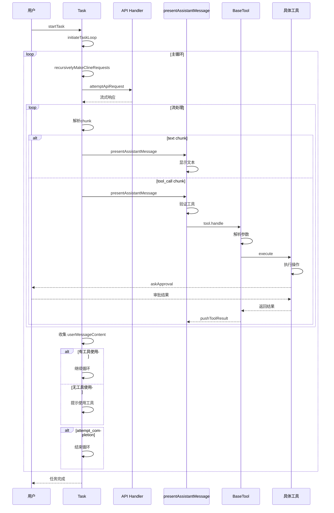

# Roo-Code 工具调用迭代流程分析

## 概述

本文档详细分析了 Roo-Code 项目中工具调用和迭代的完整流程。Roo-Code 是一个 VS Code 扩展，它使用 LLM（大语言模型）来执行各种开发任务，通过工具调用实现与系统的交互。

## 核心组件架构



## 完整迭代流程

### 1. 任务启动阶段



### 2. 主循环流程

[`Task.ts`](docs/参考项目/Roo-Code-main/src/core/task/Task.ts:2003) 中的 `initiateTaskLoop` 方法是入口：

```typescript
private async initiateTaskLoop(userContent: Anthropic.Messages.ContentBlockParam[]): Promise<void> {
    // 初始化检查点服务
    getCheckpointService(this)
    
    let nextUserContent = userContent
    let includeFileDetails = true
    
    this.emit(RooCodeEventName.TaskStarted)
    
    while (!this.abort) {
        // 递归调用 LLM 获取响应
        const didEndLoop = await this.recursivelyMakeClineRequests(nextUserContent, includeFileDetails)
        includeFileDetails = false
        
        if (didEndLoop) {
            break
        } else {
            // 如果模型没有使用工具，提示它使用工具或完成任务
            nextUserContent = [{ type: "text", text: formatResponse.noToolsUsed(toolProtocol) }]
            this.consecutiveMistakeCount++
        }
    }
}
```

### 3. 递归请求流程



### 4. API 请求与流处理

[`Task.ts`](docs/参考项目/Roo-Code-main/src/core/task/Task.ts:3320) 中的 `attemptApiRequest` 方法：

```typescript
public async *attemptApiRequest(retryAttempt: number = 0): ApiStream {
    // 1. 应用速率限制
    // 2. 获取系统提示词
    // 3. 管理上下文（压缩、截断）
    // 4. 检查自动审批限制
    // 5. 构建工具列表（Native协议）
    // 6. 创建消息流
    const stream = this.api.createMessage(systemPrompt, cleanConversationHistory, metadata)
    
    // 7. 等待第一个chunk（处理重试逻辑）
    const firstChunk = await iterator.next()
    yield firstChunk.value
    
    // 8. 继续yield后续chunks
    yield* iterator
}
```

### 5. 消息呈现与工具执行

[`presentAssistantMessage.ts`](docs/参考项目/Roo-Code-main/src/core/assistant-message/presentAssistantMessage.ts:61) 是核心处理函数：



### 6. 工具基类设计

[`BaseTool.ts`](docs/参考项目/Roo-Code-main/src/core/tools/BaseTool.ts:44) 定义了统一的工具接口：

```typescript
export abstract class BaseTool<TName extends ToolName> {
    // 工具名称
    abstract readonly name: TName
    
    // XML协议参数解析
    abstract parseLegacy(params: Partial<Record<string, string>>): ToolParams<TName>
    
    // 工具执行逻辑
    abstract execute(params: ToolParams<TName>, task: Task, callbacks: ToolCallbacks): Promise<void>
    
    // 处理流式部分消息（可选）
    async handlePartial(task: Task, block: ToolUse<TName>): Promise<void> { }
    
    // 主入口：统一处理两种协议
    async handle(task: Task, block: ToolUse<TName>, callbacks: ToolCallbacks): Promise<void> {
        // 1. 处理部分消息
        if (block.partial) {
            await this.handlePartial(task, block)
            return
        }
        
        // 2. 解析参数
        let params: ToolParams<TName>
        if (block.nativeArgs !== undefined) {
            // Native协议：直接使用类型化参数
            params = block.nativeArgs as ToolParams<TName>
        } else {
            // XML协议：解析字符串参数
            params = this.parseLegacy(block.params)
        }
        
        // 3. 执行工具
        await this.execute(params, task, callbacks)
    }
}
```

### 7. 工具回调机制

每个工具执行时会收到一组回调函数：

```typescript
interface ToolCallbacks {
    // 请求用户审批
    askApproval: (type: ClineAsk, partialMessage?: string, progressStatus?: ToolProgressStatus) => Promise<boolean>
    
    // 处理错误
    handleError: (action: string, error: Error) => Promise<void>
    
    // 推送工具结果
    pushToolResult: (content: ToolResponse) => void
    
    // 移除流式中的闭合标签
    removeClosingTag: (tag: string, text?: string) => string
    
    // 工具协议类型
    toolProtocol: ToolProtocol
}
```

### 8. 协议支持

Roo-Code 支持两种工具协议：

#### XML 协议
```xml
<read_file>
<path>src/main.ts</path>
</read_file>
```

#### Native 协议
```json
{
  "type": "tool_use",
  "id": "call_123",
  "name": "read_file",
  "input": {
    "files": [{"path": "src/main.ts"}]
  }
}
```

协议选择逻辑：
- 如果 `block.id` 存在 → Native 协议
- 如果 `block.id` 不存在 → XML 协议

### 9. 工具结果收集

工具执行完成后，结果通过 `pushToolResult` 收集：

```typescript
const pushToolResult = (content: ToolResponse) => {
    if (toolProtocol === TOOL_PROTOCOL.NATIVE) {
        // Native协议：创建 tool_result 块
        cline.userMessageContent.push({
            type: "tool_result",
            tool_use_id: toolCallId,
            content: resultContent,
        })
    } else {
        // XML协议：创建 text 块
        cline.userMessageContent.push({
            type: "text",
            text: `${toolDescription()} Result:`
        })
        cline.userMessageContent.push({
            type: "text",
            text: content
        })
    }
    
    // 标记工具已使用
    cline.didAlreadyUseTool = true
}
```

### 10. 迭代终止条件

循环在以下情况下终止：

1. **用户中止** - `this.abort = true`
2. **任务完成** - `attempt_completion` 工具被调用并通过审批
3. **达到最大请求限制** - 用户拒绝重置计数
4. **上下文窗口超限** - 重试次数超过 `MAX_CONTEXT_WINDOW_RETRIES`

## 完整时序图



## 关键状态管理

| 状态变量 | 作用 | 更新时机 |
|---------|------|---------|
| `isStreaming` | 是否正在流式接收 | API请求开始/结束 |
| `didCompleteReadingStream` | 流是否完成 | 流结束时设为true |
| `userMessageContentReady` | 用户消息是否准备好 | 所有块处理完成时设为true |
| `didRejectTool` | 用户是否拒绝了工具 | askApproval返回false时 |
| `didAlreadyUseTool` | 是否已使用工具 | pushToolResult后 |
| `currentStreamingContentIndex` | 当前处理的块索引 | 块处理完成后递增 |
| `presentAssistantMessageLocked` | 消息处理是否锁定 | 进入/退出presentAssistantMessage |

## 总结

Roo-Code 的工具调用迭代流程是一个精心设计的状态机：

1. **任务驱动** - Task 类管理整个生命周期
2. **流式处理** - 支持实时流式响应处理
3. **协议兼容** - 同时支持 XML 和 Native 两种协议
4. **工具抽象** - BaseTool 提供统一的工具接口
5. **审批机制** - 所有敏感操作需要用户审批
6. **错误恢复** - 支持自动重试和上下文压缩
7. **检查点** - 文件修改前自动保存检查点

这种设计使得 Roo-Code 能够安全、可靠地执行 AI 代理任务，同时保持良好的用户体验和可扩展性。