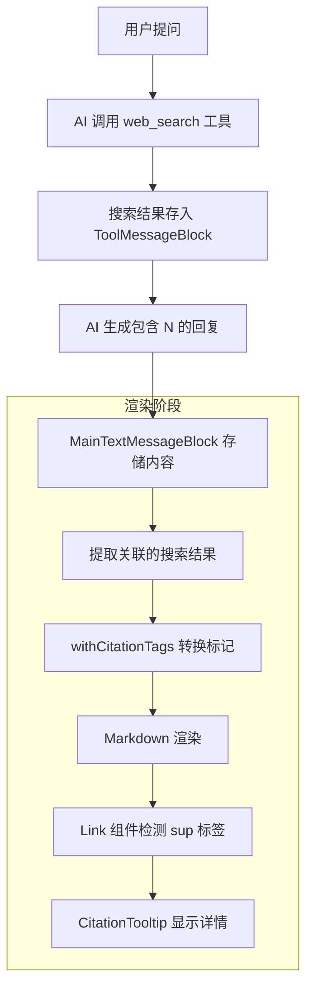
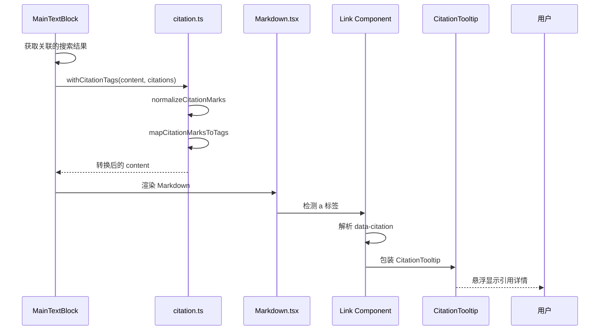

# 网络搜索引用系统设计方案

> **版本**: v1.1 (优化版)
> **更新**: 采纳简化建议，一步转换，动态关联

## 1. 问题描述

当前系统中，AI 返回的消息包含 `[2]` 这样的引用标记，但它们没有被渲染成可点击的引用链接。

**期望效果**：
```
香港宏福苑发生严重火灾... [2] ← 可点击，悬浮显示引用详情
```

## 2. 现有架构分析

### 2.1 消息块类型（已存在）

```typescript
// src/shared/types/newMessage.ts
export interface CitationMessageBlock extends BaseMessageBlock {
  type: typeof MessageBlockType.CITATION
  content: string
  source?: string
  url?: string
  sources?: Array<{
    title?: string
    url?: string
    content?: string
  }>
  response?: any
  knowledge?: any[]
}
```

### 2.2 搜索结果存储位置

```typescript
// ToolMessageBlock.metadata.rawMcpToolResponse.response.webSearchResult.results
interface SearchResult {
  title: string;
  url: string;
  snippet?: string;
  content?: string;
}
```

### 2.3 AI 提示词（已存在）

```typescript
// src/shared/store/thunks/message/helpers/agenticLoop.ts:119-126
const citationData = results.slice(0, 10).map((r: any, i: number) => 
  `[${i + 1}] ${r.title || 'No title'}: ${(r.snippet || r.content || '').slice(0, 150)}`
);

return `搜索完成，找到 ${results.length} 个结果：
${citationData.join('\n')}

请基于以上搜索结果回答用户问题，使用 [1]、[2] 等格式引用来源。`;
```

## 3. 引用系统架构设计

### 3.1 整体数据流



### 3.2 引用数据关联机制

**方案 A：通过 Block 引用（推荐）**

在 `MainTextMessageBlock` 中添加引用关联字段：

```typescript
export interface MainTextMessageBlock extends BaseMessageBlock {
  type: typeof MessageBlockType.MAIN_TEXT
  content: string
  // 新增：关联的工具块 ID（用于提取搜索结果）
  toolBlockIds?: string[]
}
```

**方案 B：通过消息级别关联**

在同一消息的 blocks 中查找 `ToolMessageBlock`，提取其搜索结果。

### 3.3 核心模块设计

#### 3.3.1 引用数据类型定义

```typescript
// src/shared/types/citation.ts

export interface Citation {
  /** 引用序号 1-based */
  number: number
  /** 来源 URL */
  url: string
  /** 标题 */
  title?: string
  /** 内容摘要 */
  content?: string
  /** 主机名 */
  hostname?: string
  /** 引用类型 */
  type: 'websearch' | 'knowledge' | 'memory'
  /** 是否显示 favicon */
  showFavicon?: boolean
  /** 额外元数据 */
  metadata?: Record<string, any>
}

export interface CitationContext {
  /** 关联的消息 ID */
  messageId: string
  /** 引用列表 */
  citations: Citation[]
  /** 搜索来源 */
  source?: 'openai' | 'gemini' | 'default'
}
```

#### 3.3.2 引用工具函数（简化版）

```typescript
// src/shared/utils/citation.ts

// 严格的引用标记正则：排除 Markdown 链接格式
// (?<!\]) - 前面不是 ]（排除 [text][N] 格式）
// \[(\d{1,2})\] - 匹配 [1] 到 [99]
// (?!\() - 后面不是 (（排除 [N](url) 格式）
const CITATION_REGEX = /(?<!\])\[(\d{1,2})\](?!\()/g;

/**
 * 从搜索结果生成引用列表
 */
export function createCitationsFromSearchResults(
  results: SearchResult[]
): Citation[];

/**
 * 一步完成引用转换（简化版）
 * [N] → [<sup data-citation='json'>N</sup>](url)
 *
 * 使用严格正则排除 Markdown 链接冲突
 */
export function withCitationTags(
  content: string,
  citations: Citation[]
): string {
  if (!content || citations.length === 0) return content;
  
  return content.replace(CITATION_REGEX, (match, num) => {
    const citationNum = parseInt(num, 10);
    const citation = citations[citationNum - 1]; // 1-based index
    
    if (!citation) return match; // 保持原样
    
    const supData = {
      id: citationNum,
      url: citation.url,
      title: citation.title || '',
      content: citation.content?.substring(0, 200) || ''
    };
    const citationJson = encodeHTML(JSON.stringify(supData));
    
    // 生成链接格式
    const isValidUrl = citation.url?.startsWith('http');
    return `[<sup data-citation='${citationJson}'>${citationNum}</sup>]` +
           (isValidUrl ? `(${citation.url})` : '()');
  });
}
```

#### 3.3.3 CitationTooltip 组件

```typescript
// src/components/message/CitationTooltip.tsx

interface CitationTooltipProps {
  citation: Citation
  children: React.ReactNode
}

/**
 * 引用悬浮提示组件
 * 
 * 显示内容：
 * - Favicon 图标
 * - 标题
 * - 内容摘要（截断）
 * - URL
 */
export const CitationTooltip: React.FC<CitationTooltipProps> = ({
  citation,
  children
}) => {
  // 使用 MUI Tooltip 或自定义实现
};
```

#### 3.3.4 Markdown Link 组件修改

```typescript
// src/components/message/Markdown.tsx - 修改 a 标签渲染

const components = {
  a: (props: any) => {
    // 检测是否包含 <sup data-citation> 标签
    const isCitation = /* 检测逻辑 */;
    const citationData = /* 从 data-citation 提取 */;
    
    if (isCitation && citationData) {
      return (
        <CitationTooltip citation={citationData}>
          <Link {...props} />
        </CitationTooltip>
      );
    }
    
    return <Link {...props} />;
  }
};
```

## 4. 实现计划

### Phase 1: 基础类型和工具函数

| 文件 | 内容 |
|------|------|
| `src/shared/types/citation.ts` | 引用类型定义 |
| `src/shared/utils/citation.ts` | 引用转换工具函数 |
| `src/shared/utils/formats.ts` | 添加 `encodeHTML` 函数 |

### Phase 2: CitationTooltip 组件

| 文件 | 内容 |
|------|------|
| `src/components/message/CitationTooltip.tsx` | 悬浮提示组件 |
| `src/components/message/CitationTooltip.css` | 样式文件 |

### Phase 3: Markdown 渲染器集成

| 文件 | 修改内容 |
|------|---------|
| `src/components/message/Markdown.tsx` | 添加 `postProcess` prop，修改 Link 组件 |
| `src/components/message/blocks/MainTextBlock.tsx` | 调用 `withCitationTags` 处理内容 |

### Phase 4: 搜索结果关联

| 文件 | 修改内容 |
|------|---------|
| `src/shared/types/newMessage.ts` | `MainTextMessageBlock` 添加 `toolBlockIds` |
| `src/shared/store/thunks/message/*.ts` | 建立 block 关联 |

## 5. 关键实现细节

### 5.1 引用标记转换示例

**输入**（AI 原始输出）：
```markdown
香港宏福苑发生严重火灾[2]
```

**中间格式**（标准化）：
```markdown
香港宏福苑发生严重火灾[cite:2]
```

**输出**（渲染用）：
```markdown
香港宏福苑发生严重火灾[<sup data-citation='{"id":2,"url":"...","title":"..."}'>2</sup>](https://...)
```

### 5.2 Markdown 渲染流程



### 5.3 sup 标签检测逻辑

参考 Cherry Studio 的实现：

```typescript
// 检测子元素中是否包含 <sup> 标签
const isCitation = React.Children.toArray(props.children).some((child) => {
  if (typeof child === 'object' && 'type' in child) {
    return child.type === 'sup';
  }
  return false;
});
```

### 5.4 引用数据提取

```typescript
// 从 sup 元素的 data-citation 属性获取引用数据
function findCitationInChildren(children: React.ReactNode): string | null {
  let citationData: string | null = null;
  
  React.Children.forEach(children, (child) => {
    if (React.isValidElement(child) && child.type === 'sup') {
      const dataCitation = child.props['data-citation'];
      if (dataCitation) {
        citationData = dataCitation;
      }
    }
  });
  
  return citationData;
}
```

## 6. 与现有系统的集成

### 6.1 搜索结果来源

搜索结果已经保存在 `ToolMessageBlock.metadata.rawMcpToolResponse` 中：

```typescript
// 从 ToolMessageBlock 提取搜索结果
function extractCitationsFromToolBlock(block: ToolMessageBlock): Citation[] {
  const response = block.metadata?.rawMcpToolResponse;
  const results = response?.response?.webSearchResult?.results || 
                  response?.response?.results || 
                  [];
  
  return results.map((r, i) => ({
    number: i + 1,
    url: r.url,
    title: r.title,
    content: r.snippet || r.content,
    hostname: new URL(r.url).hostname,
    type: 'websearch',
    showFavicon: true
  }));
}
```

### 6.2 Block 关联策略

在消息流中建立 MainTextBlock 与 ToolBlock 的关联：

```typescript
// 在同一消息中查找工具块
function findRelatedToolBlocks(message: Message, blockEntities: Record<string, MessageBlock>): ToolMessageBlock[] {
  return message.blocks
    .map(id => blockEntities[id])
    .filter((block): block is ToolMessageBlock => 
      block?.type === MessageBlockType.TOOL && 
      (block.toolName?.includes('web_search') || block.toolId?.includes('web_search'))
    );
}
```

## 7. UI/UX 设计

### 7.1 引用角标样式

```css
/* 引用角标 - 上标数字 */
.citation-sup {
  cursor: pointer;
  color: var(--theme-primary);
  font-size: 0.75em;
  vertical-align: super;
  padding: 0 2px;
  text-decoration: none;
}

.citation-sup:hover {
  text-decoration: underline;
}
```

### 7.2 CitationTooltip 样式

```css
/* 悬浮提示卡片 */
.citation-tooltip {
  max-width: 320px;
  padding: 12px;
  background: var(--theme-bg-paper);
  border-radius: 8px;
  box-shadow: 0 4px 16px rgba(0, 0, 0, 0.15);
}

.citation-tooltip-header {
  display: flex;
  align-items: center;
  gap: 8px;
  margin-bottom: 8px;
}

.citation-tooltip-title {
  font-weight: 500;
  overflow: hidden;
  text-overflow: ellipsis;
  white-space: nowrap;
}

.citation-tooltip-content {
  font-size: 0.875rem;
  color: var(--theme-text-secondary);
  display: -webkit-box;
  -webkit-line-clamp: 3;
  -webkit-box-orient: vertical;
  overflow: hidden;
}
```

## 8. 性能考虑

1. **缓存引用数据**：避免重复解析 JSON
2. **惰性渲染 Tooltip**：只在 hover 时渲染内容
3. **Favicon 缓存**：复用 WebSearchTool 的 favicon 加载策略

## 9. 测试计划

1. **单元测试**
   - `normalizeCitationMarks` 各种格式转换
   - `withCitationTags` 完整流程
   - 引用数据提取函数

2. **集成测试**
   - 搜索 → AI 回复 → 渲染引用的完整流程
   - 点击引用跳转到对应 URL

3. **UI 测试**
   - CitationTooltip 悬浮显示
   - 移动端触摸交互

## 10. 后续扩展

1. **知识库引用**：支持从本地知识库的引用
2. **引用列表汇总**：在消息末尾显示所有引用来源
3. **引用复制**：一键复制所有引用