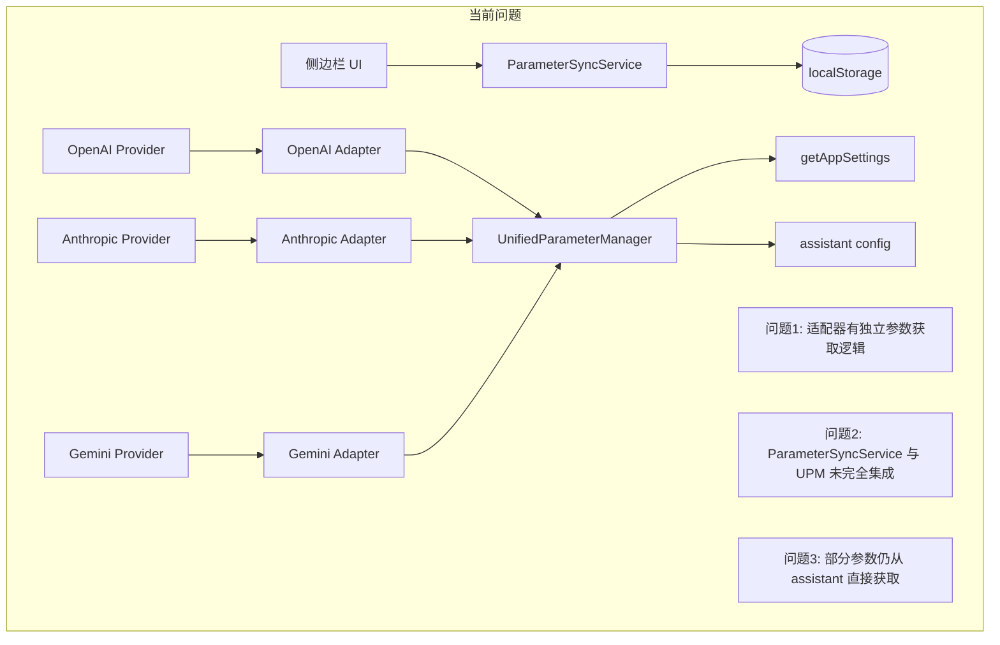
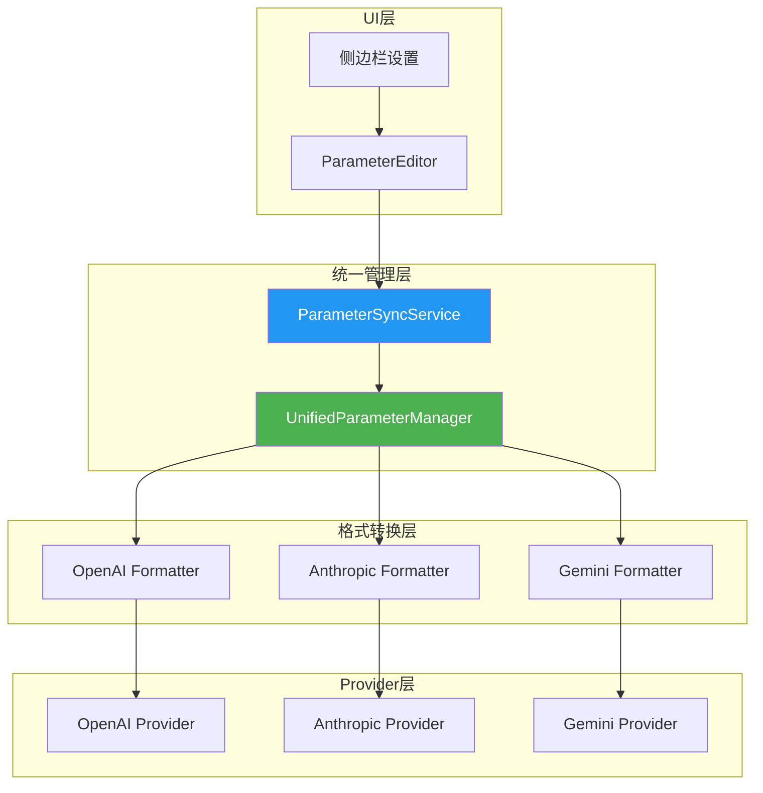
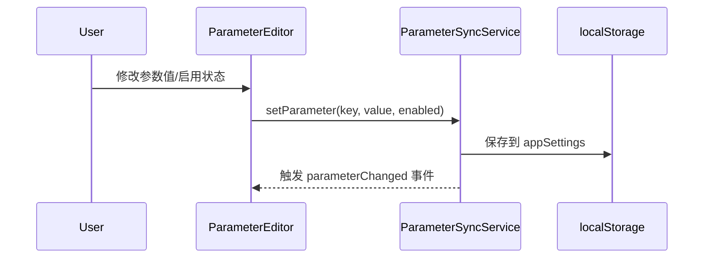
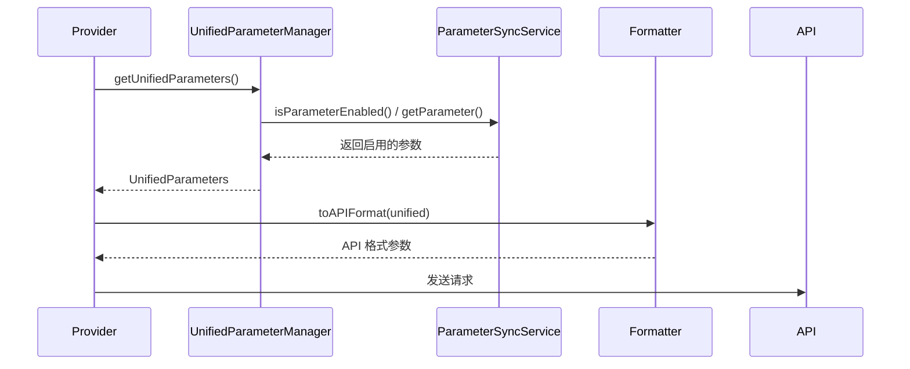

# 统一参数管理器重构方案

## 📋 概述

本文档描述将侧边栏上下文设置中的参数管理改造为统一管理模式，确保所有4个供应商（OpenAI、OpenAI-AISDK、Anthropic-AISDK、Gemini-AISDK）使用同一个参数管理器，实现参数的统一获取和分发。

## 🎯 目标

1. **统一参数来源**：所有参数从 `UnifiedParameterManager` 获取，不再分散在各个适配器中
2. **启用即生效**：侧边栏开启的参数必须出现在 API 请求中
3. **供应商适配**：根据供应商类型自动转换参数格式（camelCase → snake_case 等）
4. **消除冗余**：移除各适配器中重复的参数获取逻辑

---

## 📊 当前架构分析

### 问题诊断



### 当前供应商架构

| 供应商 | Provider 类 | 参数适配器 | 问题 |
|--------|-------------|------------|------|
| OpenAI | `OpenAIProvider` | `OpenAIParameterAdapter` | 部分参数仍从 assistant 获取 |
| OpenAI-AISDK | `OpenAIAISDKProvider` | `OpenAIParameterAdapter` | 与 OpenAI 共享，较一致 |
| Anthropic-AISDK | `AnthropicAISDKProvider` | `AnthropicParameterAdapter` | topK/stopSequences 从 assistant 获取 |
| Gemini-AISDK | `GeminiAISDKProvider` | `GeminiParameterAdapter` | thinkingBudget 逻辑分散 |

---

## 🏗️ 重构方案

### 目标架构



### 核心改动

#### 1. 重构 UnifiedParameterManager

**文件**: `src/shared/api/parameters/UnifiedParameterManager.ts`

```typescript
import { parameterSyncService, type SyncableParameterKey } from '../../services/ParameterSyncService';

export class UnifiedParameterManager {
  // 统一参数获取入口
  public getBaseParameters(): UnifiedBaseParameters {
    const params: UnifiedBaseParameters = {
      stream: parameterSyncService.getParameter('streamOutput', true)
    };

    // 温度：仅当启用时发送
    if (parameterSyncService.isParameterEnabled('temperature')) {
      params.temperature = parameterSyncService.getParameter('temperature', 0.7);
    }

    // TopP：仅当启用时发送
    if (parameterSyncService.isParameterEnabled('topP')) {
      params.topP = parameterSyncService.getParameter('topP', 1.0);
    }

    // MaxOutputTokens：默认启用
    if (parameterSyncService.isParameterEnabled('maxOutputTokens')) {
      params.maxOutputTokens = parameterSyncService.getParameter('maxOutputTokens', 4096);
    }

    return params;
  }

  public getExtendedParameters(): UnifiedExtendedParameters {
    const params: UnifiedExtendedParameters = {};

    if (parameterSyncService.isParameterEnabled('topK')) {
      params.topK = parameterSyncService.getParameter('topK', 40);
    }

    if (parameterSyncService.isParameterEnabled('frequencyPenalty')) {
      params.frequencyPenalty = parameterSyncService.getParameter('frequencyPenalty', 0);
    }

    if (parameterSyncService.isParameterEnabled('presencePenalty')) {
      params.presencePenalty = parameterSyncService.getParameter('presencePenalty', 0);
    }

    if (parameterSyncService.isParameterEnabled('seed')) {
      const seed = parameterSyncService.getParameter('seed', null);
      if (seed !== null) {
        params.seed = seed;
      }
    }

    // 停止序列
    const stopSequences = parameterSyncService.getParameter('stopSequences', []);
    if (Array.isArray(stopSequences) && stopSequences.length > 0) {
      params.stopSequences = stopSequences;
    }

    // 响应格式
    const responseFormat = parameterSyncService.getParameter('responseFormat', 'text');
    if (responseFormat && responseFormat !== 'text') {
      params.responseFormat = { type: responseFormat };
    }

    return params;
  }

  public getReasoningParameters(): UnifiedReasoningParameters | undefined {
    if (!this.isReasoningModel()) {
      return undefined;
    }

    if (parameterSyncService.isParameterEnabled('reasoningEffort')) {
      const effort = parameterSyncService.getParameter('reasoningEffort', 'medium');
      
      if (effort === 'off' || effort === 'disabled' || effort === 'none') {
        return { enabled: false, effort: 'disabled' };
      }

      const params: UnifiedReasoningParameters = {
        enabled: true,
        effort: effort as ReasoningEffort
      };

      if (parameterSyncService.isParameterEnabled('thinkingBudget')) {
        params.budgetTokens = parameterSyncService.getParameter('thinkingBudget', 2048);
      }

      return params;
    }

    return undefined;
  }
}
```

#### 2. 简化适配器为格式转换器

**OpenAI 格式转换器**:

```typescript
export class OpenAIParameterFormatter {
  /**
   * 将统一参数转换为 OpenAI API 格式
   */
  static toAPIFormat(unified: UnifiedParameters, model: Model): Record<string, any> {
    const params: Record<string, any> = {};

    // 基础参数（camelCase → snake_case）
    if (unified.temperature !== undefined) params.temperature = unified.temperature;
    if (unified.topP !== undefined) params.top_p = unified.topP;
    if (unified.maxOutputTokens !== undefined) params.max_tokens = unified.maxOutputTokens;
    if (unified.stream !== undefined) params.stream = unified.stream;

    // 扩展参数
    if (unified.topK !== undefined) params.top_k = unified.topK;
    if (unified.frequencyPenalty !== undefined) params.frequency_penalty = unified.frequencyPenalty;
    if (unified.presencePenalty !== undefined) params.presence_penalty = unified.presencePenalty;
    if (unified.seed !== undefined) params.seed = unified.seed;
    if (unified.stopSequences?.length) params.stop = unified.stopSequences;
    if (unified.responseFormat) params.response_format = unified.responseFormat;

    // 推理参数（根据模型类型）
    if (unified.reasoning?.enabled) {
      params.reasoning_effort = unified.reasoning.effort;
    }

    return params;
  }
}
```

**Anthropic 格式转换器**:

```typescript
export class AnthropicParameterFormatter {
  static toAPIFormat(unified: UnifiedParameters, model: Model): Record<string, any> {
    const params: Record<string, any> = {};

    // 基础参数
    if (unified.temperature !== undefined) params.temperature = unified.temperature;
    if (unified.topP !== undefined) params.top_p = unified.topP;
    if (unified.maxOutputTokens !== undefined) params.max_tokens = unified.maxOutputTokens;

    // Anthropic 特有参数
    if (unified.topK !== undefined) params.top_k = unified.topK;
    if (unified.stopSequences?.length) params.stop_sequences = unified.stopSequences;

    // Extended Thinking
    if (unified.reasoning?.enabled && isClaudeReasoningModel(model)) {
      params.thinking = {
        type: 'enabled',
        budget_tokens: unified.reasoning.budgetTokens || 2048
      };
    }

    return params;
  }
}
```

**Gemini 格式转换器**:

```typescript
export class GeminiParameterFormatter {
  static toAPIFormat(unified: UnifiedParameters, model: Model): Record<string, any> {
    const params: Record<string, any> = {};

    // 基础参数（Gemini 使用 camelCase）
    if (unified.temperature !== undefined) params.temperature = unified.temperature;
    if (unified.topP !== undefined) params.topP = unified.topP;
    if (unified.maxOutputTokens !== undefined) params.maxOutputTokens = unified.maxOutputTokens;

    // Gemini 特有参数
    if (unified.topK !== undefined) params.topK = unified.topK;
    if (unified.stopSequences?.length) params.stopSequences = unified.stopSequences;

    // Thinking Config
    if (unified.reasoning?.enabled && isGeminiReasoningModel(model)) {
      params.thinkingConfig = {
        thinkingBudget: unified.reasoning.budgetTokens || 2048,
        includeThoughts: true
      };
    }

    return params;
  }
}
```

#### 3. 更新 Provider 调用方式

**统一调用模式**:

```typescript
class OpenAIAISDKProvider extends BaseProvider {
  private parameterManager: UnifiedParameterManager;

  async sendChatMessage(messages: Message[], options?: ChatOptions) {
    // 1. 获取统一参数
    const unified = this.parameterManager.getUnifiedParameters(
      isReasoningModel(this.model)
    );

    // 2. 转换为 API 格式
    const apiParams = OpenAIParameterFormatter.toAPIFormat(unified, this.model);

    // 3. 发送请求
    return await this.client.chat.completions.create({
      model: this.model.id,
      messages,
      ...apiParams
    });
  }
}
```

---

## 📁 文件改动清单

### 需要修改的文件

| 文件路径 | 改动类型 | 说明 |
|----------|----------|------|
| `src/shared/api/parameters/UnifiedParameterManager.ts` | 重构 | 集成 ParameterSyncService，成为唯一参数来源 |
| `src/shared/api/parameters/adapters/openai.ts` | 简化 | 移除独立参数获取逻辑，仅保留格式转换 |
| `src/shared/api/parameters/adapters/anthropic.ts` | 简化 | 移除独立参数获取逻辑，仅保留格式转换 |
| `src/shared/api/parameters/adapters/gemini.ts` | 简化 | 移除独立参数获取逻辑，仅保留格式转换 |
| `src/shared/api/openai-aisdk/provider.ts` | 更新 | 使用统一参数获取方式 |
| `src/shared/api/anthropic-aisdk/provider.ts` | 更新 | 使用统一参数获取方式 |
| `src/shared/api/gemini-aisdk/provider.ts` | 更新 | 使用统一参数获取方式 |
| `src/shared/services/ParameterSyncService.ts` | 微调 | 确保所有参数有对应的启用开关 |

### 需要新增的文件

| 文件路径 | 说明 |
|----------|------|
| `src/shared/api/parameters/formatters/index.ts` | 导出所有格式转换器 |
| `src/shared/api/parameters/formatters/openai.ts` | OpenAI 格式转换器 |
| `src/shared/api/parameters/formatters/anthropic.ts` | Anthropic 格式转换器 |
| `src/shared/api/parameters/formatters/gemini.ts` | Gemini 格式转换器 |

---

## 🔄 数据流

### 参数设置流程



### 参数获取流程



---

## ✅ 验收标准

1. **参数同步正确**
   - 侧边栏修改参数后，API 请求中应包含对应参数
   - 未启用的参数不应出现在 API 请求中

2. **供应商兼容**
   - OpenAI: `temperature`, `top_p`, `max_tokens`, `frequency_penalty`, `presence_penalty`, `stop`, `seed`
   - Anthropic: `temperature`, `top_p`, `max_tokens`, `top_k`, `stop_sequences`, `thinking`
   - Gemini: `temperature`, `topP`, `maxOutputTokens`, `topK`, `stopSequences`, `thinkingConfig`

3. **推理参数正确**
   - 推理模型启用时，应包含对应的推理参数
   - 非推理模型不应发送推理参数

4. **日志验证**
   - 控制台应输出 `[UnifiedParameterManager] 参数: {...}` 日志
   - 可追踪参数来源和转换过程

---

## 🚀 实施步骤

### Phase 1: 重构核心管理器
1. 重构 `UnifiedParameterManager`，集成 `ParameterSyncService`
2. 更新单元测试

### Phase 2: 创建格式转换器
1. 创建 OpenAI/Anthropic/Gemini 格式转换器
2. 移除适配器中的冗余逻辑

### Phase 3: 更新 Provider
1. 更新 `OpenAIAISDKProvider` 使用新模式
2. 更新 `AnthropicAISDKProvider` 使用新模式
3. 更新 `GeminiAISDKProvider` 使用新模式
4. 更新 `OpenAIProvider` 使用新模式

### Phase 4: 验证与测试
1. 手动测试各供应商参数传递
2. 验证侧边栏设置同步
3. 检查控制台日志

---

## 📝 注意事项

1. **向后兼容**: 保持 `assistant.settings` 作为备用来源，确保旧数据可用
2. **默认值处理**: 未启用的参数不发送，让 API 使用服务端默认值
3. **类型安全**: 使用 TypeScript 确保参数类型正确
4. **错误处理**: 参数获取失败时使用合理默认值

---

## 📅 预计时间

- Phase 1: 2小时
- Phase 2: 1.5小时
- Phase 3: 2小时
- Phase 4: 1小时

**总计**: 约 6-7 小时