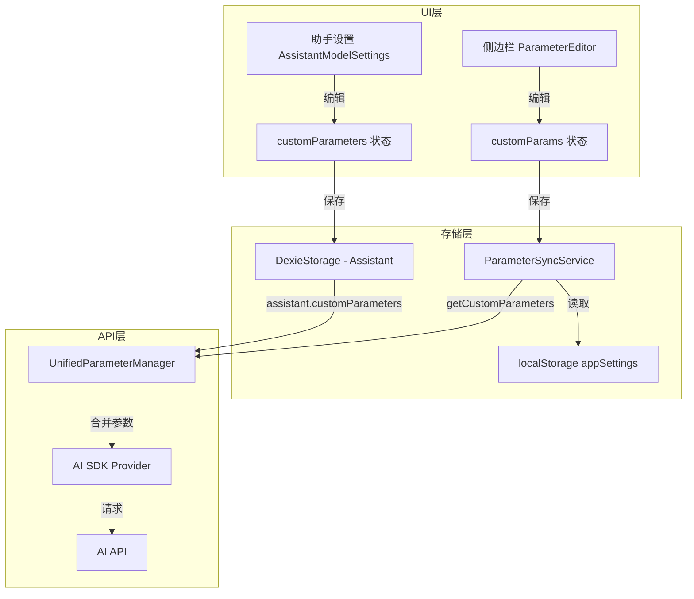

# 自定义参数功能修复方案

## 问题分析

经过对比分析 AetherLink 项目和 Cherry Studio 参考实现，发现自定义参数功能存在以下问题：

### 发现的问题清单

| # | 位置 | 问题描述 | 严重程度 |
|---|------|----------|----------|
| 1 | [`Assistant.ts`](../src/shared/types/Assistant.ts) | 缺少 `customParameters` 字段定义 | 🔴 高 |
| 2 | [`AssistantModelSettings.tsx`](../src/components/TopicManagement/SettingsTab/AssistantModelSettings.tsx:259-261) | 自定义参数不会保存到助手（有 TODO 注释） | 🔴 高 |
| 3 | [`DynamicContextSettings.tsx`](../src/components/TopicManagement/SettingsTab/DynamicContextSettings.tsx:296-302) | 没有传递 `customParams` 和 `onCustomParamsChange` 给 ParameterEditor | 🟡 中 |
| 4 | [`ParameterEditor.tsx`](../src/components/ParameterEditor/ParameterEditor.tsx:286) | 自定义参数仅存储在组件内部状态，未持久化 | 🟡 中 |
| 5 | [`ParameterSyncService.ts`](../src/shared/services/ParameterSyncService.ts) | 没有处理自定义参数的同步 | 🔴 高 |
| 6 | [`UnifiedParameterManager.ts`](../src/shared/api/parameters/UnifiedParameterManager.ts) | 没有获取和合并自定义参数 | 🔴 高 |
| 7 | API Provider 层 | 没有将自定义参数合并到 API 请求中 | 🔴 高 |

---

## Cherry Studio 参考实现

Cherry Studio 的自定义参数处理方式：

### 1. 数据结构定义

Cherry Studio 中 Assistant 类型包含 `settings.customParameters`：

```typescript
// Cherry Studio 的 Assistant 类型 (推测)
interface Assistant {
  settings?: {
    customParameters?: Array<{
      name: string;
      value: string | number | boolean;
      type: 'string' | 'number' | 'boolean' | 'json';
    }>;
    // 其他设置...
  };
}
```

### 2. 自定义参数转换函数

来自 [`reasoning.ts:616-639`](./参考项目/cherry-studio-main/src/renderer/src/aiCore/utils/reasoning.ts:616-639)：

```typescript
export function getCustomParameters(assistant: Assistant): Record<string, any> {
  return (
    assistant?.settings?.customParameters?.reduce((acc, param) => {
      if (!param.name?.trim()) {
        return acc
      }
      if (param.type === 'json') {
        const value = param.value as string
        if (value === 'undefined') {
          return { ...acc, [param.name]: undefined }
        }
        try {
          return { ...acc, [param.name]: JSON.parse(value) }
        } catch {
          return { ...acc, [param.name]: value }
        }
      }
      return {
        ...acc,
        [param.name]: param.value
      }
    }, {}) || {}
  )
}
```

### 3. 合并到 Provider 选项

来自 [`options.ts:205-207`](./参考项目/cherry-studio-main/src/renderer/src/aiCore/utils/options.ts:205-207)：

```typescript
// 合并自定义参数到 provider 特定的选项中
providerSpecificOptions = {
  ...providerSpecificOptions,
  ...getCustomParameters(assistant)
}
```

---

## 修复方案

### 阶段 1：数据类型修复

#### 1.1 更新 Assistant 类型

**文件**: `src/shared/types/Assistant.ts`

```typescript
// 添加自定义参数类型定义
export type CustomParameterType = 'string' | 'number' | 'boolean' | 'json';

export interface CustomParameter {
  name: string;
  value: string | number | boolean | object;
  type: CustomParameterType;
}

export interface Assistant {
  // ... 现有字段 ...
  
  // 🆕 添加自定义参数字段
  customParameters?: CustomParameter[];
}
```

### 阶段 2：持久化层修复

#### 2.1 更新 AssistantModelSettings.tsx

**文件**: `src/components/TopicManagement/SettingsTab/AssistantModelSettings.tsx`

修改点：
1. 从 `assistant.customParameters` 初始化状态（第 259-261 行）
2. 保存时包含 `customParameters`（第 444-445 行）

```typescript
// 第 259-261 行修改
// 初始化时从 assistant 获取
setCustomParameters(assistant.customParameters || []);

// 第 444-445 行修改
const updatedAssistant: Assistant = {
  ...assistant,
  // ... 其他字段 ...
  customParameters, // 保存自定义参数
  updatedAt: new Date().toISOString()
};
```

#### 2.2 更新 ParameterSyncService

**文件**: `src/shared/services/ParameterSyncService.ts`

添加自定义参数的存储和同步：

```typescript
// 添加到 SYNCABLE_PARAMETERS
export const SYNCABLE_PARAMETERS = [
  // ... 现有参数 ...
  'customParameters', // 🆕 添加
] as const;

// 添加自定义参数的获取方法
getCustomParameters(): CustomParameter[] {
  const settings = this.getSettings();
  return settings.customParameters || [];
}

// 添加自定义参数的设置方法
setCustomParameters(params: CustomParameter[]): void {
  const settings = this.getSettings();
  settings.customParameters = params;
  this.saveSettings(settings);
  this.dispatchParameterChange('customParameters', params);
}
```

### 阶段 3：侧边栏设置修复

#### 3.1 更新 DynamicContextSettings.tsx

**文件**: `src/components/TopicManagement/SettingsTab/DynamicContextSettings.tsx`

修改点：
1. 添加 `customParams` 状态从 `parameterSyncService` 加载
2. 传递 `customParams` 和 `onCustomParamsChange` 给 `ParameterEditor`

```typescript
// 添加自定义参数状态
const [customParams, setCustomParams] = useState<CustomParameter[]>(() => {
  return parameterSyncService.getCustomParameters();
});

// 处理自定义参数变化
const handleCustomParamsChange = useCallback((params: CustomParameter[]) => {
  setCustomParams(params);
  parameterSyncService.setCustomParameters(params);
}, []);

// 传递给 ParameterEditor
<ParameterEditor
  providerType={providerType}
  values={paramValues}
  enabledParams={enabledParams}
  onChange={handleParamChange}
  onToggle={handleParamToggle}
  customParams={customParams}                    // 🆕 添加
  onCustomParamsChange={handleCustomParamsChange} // 🆕 添加
/>
```

### 阶段 4：API 调用层修复

#### 4.1 更新 UnifiedParameterManager

**文件**: `src/shared/api/parameters/UnifiedParameterManager.ts`

添加自定义参数处理：

```typescript
import type { CustomParameter } from '../../types/Assistant';
import { parameterSyncService } from '../../services/ParameterSyncService';

/**
 * 获取自定义参数（转换为 API 格式）
 * 参考 Cherry Studio 实现
 */
public getCustomParameters(): Record<string, any> {
  const customParams = parameterSyncService.getCustomParameters();
  
  return customParams.reduce((acc, param) => {
    if (!param.name?.trim()) {
      return acc;
    }
    
    if (param.type === 'json') {
      const value = param.value as string;
      if (value === 'undefined') {
        return { ...acc, [param.name]: undefined };
      }
      try {
        return { ...acc, [param.name]: JSON.parse(value) };
      } catch {
        return { ...acc, [param.name]: value };
      }
    }
    
    return {
      ...acc,
      [param.name]: param.value
    };
  }, {});
}

/**
 * 获取完整的统一参数（包含自定义参数）
 */
public getUnifiedParameters(
  isReasoningModel: boolean = false,
  overrides?: Partial<UnifiedParameters>
): UnifiedParameters & { customParameters?: Record<string, any> } {
  const base = this.getBaseParameters(overrides);
  const extended = this.getExtendedParameters(overrides);
  const reasoning = this.getReasoningParameters(isReasoningModel);
  const customParameters = this.getCustomParameters(); // 🆕 添加

  const unified = {
    ...base,
    ...extended,
    reasoning,
    customParameters, // 🆕 添加
  };

  console.log('[UnifiedParameterManager] 参数:', unified);

  return unified;
}
```

#### 4.2 更新各 Provider 实现

在各 AI SDK Provider 中合并自定义参数：

**示例** - `src/shared/api/openai-aisdk/provider.ts`：

```typescript
// 在构建 API 请求时
const unifiedParams = parameterManager.getUnifiedParameters(isReasoningModel);
const { customParameters, ...standardParams } = unifiedParams;

// 合并自定义参数到请求选项
const requestOptions = {
  ...standardParams,
  ...customParameters, // 自定义参数直接展开到请求中
};
```

---

## 数据流程图



---

## 修复优先级

| 优先级 | 任务 | 预估时间 |
|--------|------|----------|
| P0 | 更新 `Assistant.ts` 添加 `customParameters` 字段 | 5 分钟 |
| P0 | 修复 `AssistantModelSettings.tsx` 保存逻辑 | 15 分钟 |
| P1 | 更新 `ParameterSyncService.ts` 支持自定义参数 | 20 分钟 |
| P1 | 修复 `DynamicContextSettings.tsx` 传递自定义参数 | 10 分钟 |
| P1 | 更新 `UnifiedParameterManager.ts` 获取和合并自定义参数 | 20 分钟 |
| P2 | 更新各 AI Provider 合并自定义参数 | 30 分钟 |
| P2 | 添加单元测试 | 30 分钟 |

**总预估时间**: 约 2 小时

---

## 测试计划

### 功能测试

1. **侧边栏自定义参数**
   - [ ] 添加新自定义参数
   - [ ] 编辑自定义参数名称和值
   - [ ] 删除自定义参数
   - [ ] 开关自定义参数启用状态
   - [ ] 刷新页面后参数仍然存在

2. **助手设置自定义参数**
   - [ ] 添加新自定义参数
   - [ ] 选择不同类型（string/number/boolean/json）
   - [ ] 保存后重新打开，参数仍然存在
   - [ ] JSON 类型参数正确解析

3. **API 调用验证**
   - [ ] 自定义参数被正确合并到 API 请求
   - [ ] 控制台日志显示正确的参数值
   - [ ] 禁用的自定义参数不会发送

### 边界测试

- [ ] 空参数名处理
- [ ] 无效 JSON 值处理
- [ ] 特殊字符参数名
- [ ] 超长参数值

---

## 相关文件清单

| 文件路径 | 修改类型 |
|----------|----------|
| `src/shared/types/Assistant.ts` | 添加类型定义 |
| `src/components/TopicManagement/SettingsTab/AssistantModelSettings.tsx` | 修复保存逻辑 |
| `src/shared/services/ParameterSyncService.ts` | 添加自定义参数支持 |
| `src/components/TopicManagement/SettingsTab/DynamicContextSettings.tsx` | 传递自定义参数 |
| `src/shared/api/parameters/UnifiedParameterManager.ts` | 获取和合并自定义参数 |
| `src/shared/api/openai-aisdk/provider.ts` | 合并自定义参数到请求 |
| `src/shared/api/anthropic-aisdk/provider.ts` | 合并自定义参数到请求 |
| `src/shared/api/gemini-aisdk/provider.ts` | 合并自定义参数到请求 |
| `src/shared/api/openai/index.ts` | 合并自定义参数到请求 |